# Retail Ontology-Driven Intelligence Platform

An enterprise-grade, 5-layer retail intelligence platform built on Databricks Lakehouse. Combines a governed ontology, LLM classification, graph-based substitution reasoning, and a LangGraph multi-tool agent to power AI shopping assistants, Genie NL2SQL, Retail Media Networks, and CPG Delta Sharing — all with dietary-class preservation and zero PII exposure.

---

## Table of Contents

1. [Architecture Overview](#architecture-overview)
2. [Layer 1 — Facts (Raw Data)](#layer-1--facts-raw-data)
3. [Layer 2 — Ontology](#layer-2--ontology)
4. [Layer 3 — Semantic Views](#layer-3--semantic-views)
5. [Layer 4 — Agent & Reasoning](#layer-4--agent--reasoning)
6. [Layer 5 — Consumption](#layer-5--consumption)
7. [Keto End-to-End Flow (Diagram 2)](#keto-end-to-end-flow-diagram-2)
8. [Pipeline Stages & Notebooks](#pipeline-stages--notebooks)
9. [Deployment Guide](#deployment-guide)
10. [Catalog & Schema Reference](#catalog--schema-reference)

---

## Architecture Overview

> **Databricks Lakehouse · Unity Catalog Governed · Diagram 1 of 2** — See [Keto End-to-End Flow](#keto-end-to-end-flow-diagram-2) for Diagram 2.
>
> Tier 1 (Universal) → Tier 2 (7 Domains) → Tier 3 (Application Views)

```mermaid
graph TB
    %% ── LAYER 5 — CONSUMPTION ─────────────────────────────────────────────
    subgraph L5["　　　　　LAYER 5 — CONSUMPTION　|　Who Queries the Ontology　　　　　"]
        direction LR
        C1["🤖 **AI Shopping**\n**Assistant**\nCustomer-facing app\nPersonalised queries\nAgent framework\nGenie NL2SQL"]
        C2["📊 **Data Science**\n**& Analytics**\nReal-time audience\ninsights · Campaigns\nDashboards\nGenie"]
        C3["📡 **Retail Media**\n**Network**\nCPG partner\ntargeting\nAudience reporting\nDelta Sharing"]
        C4["💊 **Pharmacy**\n**& Health**\nRx cross-sell signals\nRefill abandonment\nMulti-channel\nalerts"]
    end

    %% ── LAYER 4 — AGENT & REASONING ──────────────────────────────────────
    subgraph L4["　　LAYER 4 — AGENT & REASONING　|　LANGRAPH · MLFLOW TRACING · DOMAIN ROUTER　　"]
        direction LR
        DR["🧭 **Domain**\n**Router**\nRoutes intent\nto tool domains\nstate.domains\nconditional exec"]
        OT["🔧 **Ontology**\n**Tools** ×6\nquery_dietary\nfind_substitutes\ncheck_inventory\nget_kpm · pharmacy"]
        LF["🔄 **Lakeflow DLT**\nBronze→Silver→Gold\ngold_oos_alerts\nPersona refresh\n03:00 UTC daily"]
        LLM["🧠 **LLM + Embeddings**\nLlama 3.3 70B\nFoundation Model API\nMLlib ALS 128-dim\nMLflow tracing"]
        VS["🔍 **Vector Search**\n128-dim ALS index\nDelta-sync endpoint\nGraceful skip\nif PyPI blocked"]
        LB["🗄️ **Lakebase**\n**Agent Memory**\nagent_sessions\nagent_memory\nagent_tool_calls\nPersistent HH context"]
    end

    %% ── LAYER 3 — SEMANTIC VIEWS ──────────────────────────────────────────
    subgraph L3["　　　　LAYER 3 — SEMANTIC VIEWS　|　8 Abstract Views · Never Touch Raw Tables　　　　"]
        direction LR
        AV1["🥗 **dietary_sku_catalog**\nFiltered product catalog\nby dietary class"]
        AV2["🔀 **substitution_graph**\nSUBSTITUTABLE_FOR\n+ dietary preservation"]
        AV3["🎯 **kpm_audiences**\nKetoDieter persona\nbasket_share > 0.35"]
        AV4["📦 **unified_inventory**\nStock by product\n+ store node"]
        AV5["💊 **pharmacy_crosssell**\nRx-adjacent\ndietary recs"]
        AV6["⚠️ **atrisk_customer_radar**\nTrip-frequency drop\n30d vs prior 30d"]
        AV7["💰 **margin_aware_sub**\nfit × margin\n× similarity score"]
        AV8["📡 **retail_media_audiences**\nKPM segments for\nadvertiser targeting"]
        MV["📈 **12 Metric Views** — Genie-ready NL2SQL\nketo_households · net_revenue · digital_penetration\navg_basket_size · at_risk_value · daily_sales · inventory_health · +5"]
    end

    %% ── LAYER 2 — ONTOLOGY ────────────────────────────────────────────────
    subgraph L2["　　　LAYER 2 — ONTOLOGY　|　Three-Tier Metadata · Delta Change Data Feed　　　"]
        direction LR
        T1["🔒 **Tier 1**\n**Universal Foundation**\n8 frozen classes\nversion_registry\nARB-governed\nCHANGES REQUIRE REVIEW"]
        T2["🏗️ **Tier 2**\n**7 Domain Schemas**\n~92 classes\nproduct · customer\npharmacy · finance\nmedia · supply chain"]
        BR["🌉 **Bridge Tables**\nsku_classifications\n← LLM classifies meaning\nhousehold_lifecycle\nrx_therapeutic_class\nsku_gs1_mapping"]
        GR["🕸️ **Graph**\nrelationships\nSUBSTITUTABLE_FOR\ncosine sim > 0.5\nshared_class_ids\ndiet-class preserved"]
    end

    %% ── LAYER 1 — FACTS ──────────────────────────────────────────────────
    subgraph L1["　　LAYER 1 — FACTS　|　v2_raw · Delta Lake · CDC enabled · UC RLS · PII column-tagged　　"]
        direction LR
        F1["📋 **Transactions**\npos_transactions\n500K rows\nPartitioned by date\nCDC enabled"]
        F2["📦 **SKU Master**\nsku_master\n10K products\n→ LLM classifies\nmeaning"]
        F3["👥 **Household**\n**Profiles**\n50K households\nPII column-tagged\nUnity Catalog RLS"]
        F4["🏪 **Inventory**\nnode_inventory\n~500K snapshots\nStore · DC · 3P\nnodes · CDF streaming"]
        F5["💊 **Pharmacy Rx**\nrx_claims\nPrescriptions\nRefill · abandonment\nDelta Lake"]
    end

    %% ── FLOW ──────────────────────────────────────────────────────────────
    L1 -->|"CDC / Delta Change Feed"| L2
    L2 -->|"Generated abstract views\n— never touch raw tables"| L3
    L3 -->|"Tools exposed to agent"| L4
    L4 -->|"Answers / audiences / sharing"| L5
```



**Unity Catalog layout:**

| Catalog | Layer | Purpose |
|---------|-------|---------|
| `v2_raw` | L1 | Raw source tables — POS, SKU, households, inventory, pharmacy |
| `v2_ontology` | L2 / L3 | Ontology classes, graph edges, bridge tables, abstract/metric views |
| `v2_features` | L4 | ML embeddings — 128-dim ALS product & household vectors |
| `v2_sharing` | L5 | Delta Sharing views for CPG partners (no PII) |

---

## Layer 1 — Facts (Raw Data)

**Notebook:** `01_create_raw_schema.py` + `02_generate_sample_data.py`

### Tables

| Table | Rows | Description |
|-------|------|-------------|
| `v2_raw.transactions.pos_transactions` | 500K | Point-of-sale: UPC, household_id, store_id, qty, price, timestamp |
| `v2_raw.products.sku_master` | 10K | SKU catalog: name, brand, dept, category, certifications, price |
| `v2_raw.customers.household_profiles` | 50K | Household demographics: loyalty_tier, age_band, dietary_preference |
| `v2_raw.inventory.node_inventory_snapshots` | ~500K | On-hand / reserved / in-transit by store/DC node |
| `v2_raw.pharmacy.rx_claims` | — | Prescription data for pharmacy cross-sell signals |

### Governance

- **Change Data Feed (CDF)** enabled on all tables for incremental downstream propagation
- **Partitioning:** `pos_transactions` by `transaction_date`; `node_inventory_snapshots` by `snapshot_date`
- **UC Column Tags:** PII columns on `household_profiles` (`email`, `phone`, `address`) tagged as `pii_category = PII`
- **Row-Level Security:** Row Filter on `household_profiles` — non-admin users see only `is_active = TRUE` rows
- **Storage:** `abfss://nsp-test-data@stnsphv9452.dfs.core.windows.net/ontology/` (ADLS Gen2 managed location)

---

## Layer 2 — Ontology

**Notebooks:** `03a_create_tier1_foundation.py`, `03b_seed_tier1_foundation.py`, `04a_create_tier2_schemas.py`, `04b_seed_all_domains.py`, `05_llm_sku_classification.py`, `12_lakebase_setup.py`

### Tier 1 — Universal Foundation (Frozen)

Schema: `v2_ontology.tier1_foundation`

| Table | Contents |
|-------|---------|
| `classes_top` | 8 universal classes: Entity, Event, Location, TimeInterval, Relationship, Quantity, Role, Attribute |
| `relationship_types` | 9 valid relationship codes: SUBSTITUTABLE_FOR, HAS_INVENTORY, PURCHASED_BY, … |
| `domain_registry` | 7 registered tier-2 domain names |
| `governance_log` | ARB change log — all modifications require Architecture Review Board approval |
| `version_registry` | Schema versioning table — tracks schema_version, effective_date, change_summary |

> **CRITICAL:** Tier 1 is frozen after initial seeding. Any modification requires `governance_log` entry and ARB sign-off.

### Tier 2 — Domain Classes (~92 classes across 7 domains)

| Domain Schema | Key Classes |
|--------------|-------------|
| `tier2_product` | FoodProduct, KetoCompliant, Vegan, GlutenFree, Organic, DairyFree, Paleo, PlantBased, MediterraneanDiet, PharmacyProduct |
| `tier2_customer` | HouseholdProfile, LoyaltyTier, DietaryPreference, LifecycleStage, KetoDieter |
| `tier2_supply_chain` | InventoryNode, StockUnit, ReplenishmentOrder |
| `tier2_pharmacy` | RxClaim, TherapeuticClass, CrossSellOpportunity |
| `tier2_finance` | MarginSegment, PricePoint, RevenueDriver |
| `tier2_media` | RetailMediaAudience, PersonaSegment, AdvertiserTarget |
| `tier2_store_ops` | StoreNode, DistributionCenter, NodeInventory |

### Bridge Tables (AI-Computed)

| Table | Source | Contents |
|-------|--------|---------|
| `v2_ontology.bridge.sku_classifications` | LLM (Llama 3.3 70B) | Dietary flags, allergen flags, margin segment, pharmacy classification per SKU |
| `v2_ontology.bridge.household_lifecycle` | 90-day transactions | Lifecycle stage (ACTIVE/AT_RISK/LAPSED/NEW) per household, computed from trip frequency |
| `v2_ontology.bridge.rx_therapeutic_class` | rx_claims | Therapeutic class mapping per prescription |
| `v2_ontology.bridge.sku_gs1_mapping` | sku_master | GS1 department/category/brick code mapping per SKU |

### Graph — Semantic Relationships

Table: `v2_ontology.graph.relationships`

Contains `SUBSTITUTABLE_FOR` edges with:
- `source_entity_id` / `target_entity_id` — UPC codes
- `weight` — cosine similarity score (threshold: > 0.5)
- `shared_class_ids` — dietary classes preserved by both products (e.g. `["KetoCompliant","Vegan","DairyFree"]`)
- `rel_type = SUBSTITUTABLE_FOR`

**Dietary class preservation rule:** Both source and target must share at least one dietary class. This prevents keto shoppers from receiving non-keto substitutions.

Also includes serving tables:
- `v2_ontology.graph.sku_online_lookup` — SKU master + all LLM flags (10K rows, agent serving)
- `v2_ontology.graph.household_online_lookup` — household profiles + 90-day transaction stats

### LLM Classification (Stage 05)

Model: **Meta Llama 3.3 70B Instruct** (Databricks Foundation Model API — no external API keys)

- **Throughput:** 20 parallel threads, batches of 10 SKUs
- **Runtime:** ~25 minutes for 10K SKUs
- **Output per SKU:**

```json
{
  "dietary": {
    "is_keto_compliant": true,
    "is_vegan": true,
    "is_gluten_free": true,
    "is_organic": false,
    "is_dairy_free": true,
    "is_paleo": false,
    "is_plant_based": true,
    "is_mediterranean": false
  },
  "allergens": {
    "contains_tree_nuts": true,
    "contains_dairy": false,
    "contains_gluten": false
  },
  "margin": { "margin_segment": "HIGH|MED|LOW" },
  "pharmacy": {
    "is_pharmacy_product": false,
    "therapeutic_class": ""
  }
}
```

> **Keto rule enforced in the prompt:** `is_keto_compliant = TRUE` only if net carbs ≤ 5g/serving. Almond Milk (~1g carb) ✅, Oat Milk (~12g carb) ❌.

---

## Layer 3 — Semantic Views

**Notebooks:** `09_create_abstract_views.py`, `10_create_metric_views.py`

### 8 Abstract Views (`v2_ontology.abstractions.*`)

| View | Key Joins | Primary Use Case |
|------|-----------|-----------------|
| `dietary_sku_catalog` | sku_master + sku_classifications | "Show me all keto products" — filtered product catalog |
| `substitution_graph` | graph.relationships + sku_master + sku_classifications | "What can replace Almond Milk?" — dietary-preserving substitutes |
| `kpm_audiences` | household_profiles + pos_transactions + sku_classifications | KPM persona segmentation — KetoDieter: `keto_basket_share > 0.35` |
| `unified_inventory` | node_inventory_snapshots + sku_master | Real-time stock check by product and store |
| `pharmacy_crosssell` | rx_claims + rx_therapeutic_class + dietary_sku_catalog | Pharmacy-adjacent dietary product recommendations |
| `atrisk_customer_radar` | household_lifecycle + pos_transactions | Churn detection — trip frequency drop (current 30d vs prior 30d), `churn_risk_score HIGH/MEDIUM/LOW` |
| `margin_aware_substitution` | substitution_graph + sku_classifications | `composite_score = dietary_fit_score × margin_multiplier × similarity_score` |
| `retail_media_audiences` | kpm_audiences + household_profiles | Retail Media Network targeting segments |

#### kpm_audiences — KPM Persona Logic

```sql
-- KetoDieter persona: keto_basket_share > 0.35
SELECT
  h.household_id,
  h.loyalty_tier,
  h.lifecycle_stage,
  COUNT(DISTINCT CASE WHEN c.is_keto_compliant THEN t.upc END) * 1.0 /
    NULLIF(COUNT(DISTINCT t.upc), 0) AS keto_basket_share,
  CASE
    WHEN keto_basket_share > 0.35 THEN 'KetoDieter'
    ELSE 'GeneralShopper'
  END AS persona
FROM household_profiles h JOIN pos_transactions t JOIN sku_classifications c ...
```

#### margin_aware_substitution — Composite Score

```
composite_score = dietary_fit_score × margin_multiplier × similarity_score
  dietary_fit_score  = shared dietary class count / total dietary classes
  margin_multiplier  = 1.2 (HIGH margin) | 1.0 (MED) | 0.8 (LOW)
  similarity_score   = cosine similarity from ALS embeddings
```

### 12 Metric Views (`v2_ontology.metrics.*`)

#### 5 PDF Spec KPMs (added)

| View | Metric Definition |
|------|-----------------|
| `keto_households` | Count of households with `keto_basket_share > 0.35` (KetoDieter persona) |
| `net_revenue` | Gross sales minus returns and markdowns by day/category |
| `digital_penetration` | % of transactions originating from digital/app channel |
| `avg_basket_size` | Average items and spend per shopping trip by loyalty tier |
| `at_risk_value` | Revenue at risk from HIGH churn_risk_score households |

#### 7 Existing KPMs

| View | Metric |
|------|--------|
| `daily_sales_performance` | Transaction count, revenue, avg basket value by day |
| `inventory_health` | On-hand qty, days-of-supply, below-reorder flag by node+UPC |
| `dietary_category_sales` | Sales by dietary classification |
| `household_segment_value` | Total spend, trip frequency by loyalty segment |
| `substitution_conversion` | How often OOS substitutions are accepted |
| `keto_compliance_rate` | % of keto-classified SKUs offered as substitutes that are truly keto |
| `pharmacy_crosssell_rate` | Pharmacy cross-sell attachment rate |

---

## Layer 4 — Agent & Reasoning

**Notebooks:** `06_basket2vec_embeddings.py`, `07_vector_search_index.py`, `08_build_substitution_graph.py`, `11_lakeflow_pipeline.py`, `12_lakebase_setup.py`, `13_enterprise_agent.py`

### MLlib ALS Embeddings (Stage 06)

Model: **MLlib ALS** (Alternating Least Squares) on basket co-occurrence

- `rank = 128` (128-dimensional item and user factors)
- `alpha = 40`, `implicitPrefs = True` (purchase count as implicit feedback)
- Input: 90-day POS transactions (household × UPC implicit matrix)
- Output:
  - `v2_features.product_features.product_embeddings` — 128-dim vectors per UPC (10K rows)
  - `v2_features.household_features.household_embeddings` — 128-dim vectors per household (50K rows)

> **Implementation note:** The PDF spec called for Word2Vec 256-dim. MLlib ALS 128-dim was used instead — it produces richer co-occurrence signal from basket data than Word2Vec and runs fully on Spark without external dependencies.

### Vector Search Index (Stage 07)

- Creates a Databricks Vector Search endpoint and delta-sync index over `product_embeddings`
- **Graceful degradation:** If `databricks-vectorsearch` is unavailable (PyPI blocked by NSG), the notebook calls `dbutils.notebook.exit("SKIPPED")` and the pipeline continues
- The substitution graph (Stage 08) provides equivalent batch cosine similarity via native Spark SQL

### Substitution Graph — SUBSTITUTABLE_FOR Edges (Stage 08)

**Algorithm:**

1. Sample up to 3,000 products from `product_embeddings`
2. Pairwise cosine similarity via Spark SQL (JVM-native `aggregate` + `zip_with`):
   ```sql
   aggregate(zip_with(vec_a, vec_b, (x, y) -> x * y), 0.0, (acc, v) -> acc + v)
   / (sqrt(aggregate(vec_a, ...)) * sqrt(aggregate(vec_b, ...)))
   ```
3. Keep pairs with `cosine_sim > 0.5`
4. Join with `sku_classifications` — keep pairs where BOTH products share ≥ 1 dietary class
5. Write edges to `v2_ontology.graph.relationships`

> **Threshold note:** ALS factors produce lower cosine range than text/Word2Vec embeddings. Threshold of 0.5 is appropriate for ALS co-occurrence vectors.

### LangGraph StateGraph Agent (Stage 13)

Framework: **LangGraph** (`langgraph>=0.2`) — compiled StateGraph with typed state

#### Agent State

```python
class AgentState(TypedDict):
    user_message: str
    household_id: str
    domains: list            # ["dietary","substitution","inventory","kpm","pharmacy"]
    customer_context: str
    keto_products: str
    substitutions: str
    inventory_info: str
    kpm_info: str
    pharmacy_info: str
    tools_called: Annotated[list, operator.add]
    response: str
```

#### Graph Topology (8 nodes)

```
START
  └── route_node        (domain classification from user message)
        └── persona_node      (household profile + keto_basket_share lookup)
              └── dietary_node      (keto product catalog query)
                    └── substitution_node   (SUBSTITUTABLE_FOR graph lookup)
                          └── inventory_node    (stock check — unified_inventory)
                                └── kpm_node          (kpm_audiences persona lookup)
                                      └── pharmacy_node   (pharmacy cross-sell)
                                            └── llm_node    (Llama 3.3 70B synthesis)
                                                  └── END
```

Each node conditionally executes based on `state.domains` — nodes whose domain is not in scope are no-ops that pass state through unchanged.

#### LLM Node

- Model: `databricks-meta-llama-3-3-70b-instruct` (Foundation Model API)
- Synthesizes all tool outputs into a single natural-language response
- System prompt enforces dietary class preservation: *"For Keto customers, only suggest products where `is_keto=TRUE`. When a product is OOS, use substitutions that preserve dietary classes."*
- MLflow autologging enabled — all traces, spans, and tool calls recorded in MLflow Experiments
- `agent_version = "v2.0-langgraph"`

### Lakebase Agent Memory (Stage 12)

Persistent memory tables for cross-session agent context (Delta fallback if Lakebase Postgres unavailable):

| Table | Purpose |
|-------|---------|
| `v2_ontology.graph.agent_sessions` | Conversation session tracking |
| `v2_ontology.graph.agent_memory` | Key-value persistent memory per household |
| `v2_ontology.graph.agent_tool_calls` | Full audit log of all tool executions |

### Lakeflow DLT Pipeline (Stage 11)

**Job config:** `ontology-daily-persona-refresh` (Databricks Workflow, cron: `0 3 * * *` UTC)

```
Bronze (raw stream)     → Silver (deduplicated/cleaned)     → Gold (aggregated)
  pos_transactions_raw       pos_transactions_clean              daily_sales
  inventory_raw              inventory_clean                     inventory_health
                                                             Gold: gold_oos_alerts (OOS + substitute available)
                                                             Gold: kpm_audiences_daily (persona refresh at 03:00 UTC)
```

- Photon enabled, CDF enabled, triggered mode (not continuous)
- `gold_oos_alerts`: joins OOS inventory with substitution graph — pre-computed for low-latency agent serving
- `kpm_audiences_daily`: daily persona refresh (KetoDieter recalculation at 03:00 UTC)

---

## Layer 5 — Consumption

**Notebooks:** `13_enterprise_agent.py`, `14_delta_sharing.py`

### AI Shopping Assistant

The LangGraph agent (Stage 13) is the primary consumption interface. Household `HH00041872` ("Sarah") can ask:
- *"I need Almond Milk but it's out of stock."* → OOS resolution with keto-safe substitutes
- *"Build me a keto meal plan for the week."* → persona-aware product discovery
- *"What pharmacy products pair with my prescriptions?"* → cross-sell via therapeutic class

### Genie NL2SQL

All 12 metric views in `v2_ontology.metrics` are Genie-ready — natural language queries like:
- *"How many keto households do we have this month?"* → `keto_households` view
- *"What is our net revenue by category?"* → `net_revenue` view
- *"Which customers are at risk of churning?"* → `at_risk_value` + `atrisk_customer_radar`

### Retail Media Network

`retail_media_audiences` view surfaces KPM persona segments for advertiser targeting:
- KetoDieter segment (keto_basket_share > 0.35)
- At-risk high-value households (churn_risk HIGH + high lifetime value)
- Pharmacy cross-sell candidates

### Delta Sharing (CPG Partners)

Share: `ontology-cpg-partner-share` | Recipient: `cpg-partner-demo`

| Sharing View | Data Shared | PII? |
|-------------|------------|------|
| `cpg_product_performance` | Units sold, revenue, price elasticity by brand/category | None |
| `cpg_dietary_audiences` | Persona counts by dietary segment (KetoDieter count, not IDs) | None |
| `cpg_substitution_insights` | Which products substitute for which, and frequency | None |
| `kpm_audiences` | Persona counts only — no household IDs, no PII | None |

> **Privacy guarantee:** `kpm_audiences` is shared as persona-level aggregates (counts) only. No household IDs, no transaction details, no PII ever cross the share boundary.

---

## Keto End-to-End Flow (Diagram 2)

> **How the ontology turns a customer's purchase history into a personalised, OOS-safe meal plan** — Diagram 2 of 2

### Sarah — Loyalty Customer · HH00041872

| keto_basket_share | Spend (last 90d) | Shopping Trips | Assigned Persona |
|:-----------------:|:----------------:|:--------------:|:----------------:|
| **0.41** | **$312** | **18** | **KetoDieter** |

```mermaid
flowchart TD
    Sarah(["👤 Sarah · HH00041872\nActive shopper · Primary store STORE_042\n90-day purchase window analysed"])

    subgraph S1["① LAYER 1 — FACTS  (L1)"]
        direction LR
        L1a["📋 Purchase history ingested\n90 days of transactions\npos_transactions · CDC enabled"]
        L1b["📦 SKU attributes stored\nUPC · brand · dept · category\ncertifications · price"]
    end

    subgraph S2["② LAYER 2 — LLM CLASSIFICATION  (L2 · Bridge)"]
        direction LR
        L2a["🧠 LLM classifies every SKU\nAlmond Milk → is_keto_compliant = TRUE\nOat Milk → is_keto_compliant = FALSE\n(net carbs: ~1g vs ~12g)"]
        L2b["🗂️ Written to bridge.sku_classifications\nDietary · Allergen · Margin · Pharmacy\nper SKU · confidence scored"]
    end

    subgraph S3["③ LAYER 2 — GRAPH  (L2 · Substitution Graph)"]
        direction LR
        L3a["🕸️ ALS 128-dim basket embeddings\nAlmond Milk + Coconut Milk\nco-occur in keto baskets\ncosine_sim = 0.89  > 0.50 ✅"]
        L3b["✅ SUBSTITUTABLE_FOR edge created\nAlmond Milk → Coconut Milk\nshared_class_ids = [KetoCompliant, Vegan\nDairyFree, GlutenFree]\n❌ Oat Milk: sim=0.21, not keto → NO edge"]
    end

    subgraph S4["④ LAYER 2→3 — PERSONA INFERENCE  (L3 · kpm_audiences)"]
        L4a["🎯 keto_basket_share = 0.41\n0.41 > 0.35 threshold\nlifecycle_stage = ACTIVE\npersona = KetoDieter ✅"]
    end

    subgraph S5["⑤ LAYER 4 — AGENT REQUEST  (LangGraph)"]
        direction LR
        L5a["💬 Sarah asks:\n'Build me a 5-day keto meal plan.\nI need Almond Milk but it's OOS.'"]
        L5b["🧭 Domain Router\ndomains = [dietary, substitution,\ninventory, kpm]\nLangGraph: 8-node StateGraph\nMLflow trace recorded"]
    end

    subgraph S6["⑥ LAYER 3 — OOS RESOLUTION  (L3 · margin_aware_substitution)"]
        direction LR
        L6a["❌ Almond Milk at STORE_042\nunified_inventory: qty = 0  OOS"]
        L6b["✅ Coconut Milk at STORE_042\nqty = 24  In Stock\ncomposite_score = 0.95 × 1.2 × 0.89\n= 1.014  ← top substitute"]
    end

    subgraph S7["⑦ LAYER 5 — DOWNSTREAM VALUE  (L5 · Consumption)"]
        direction LR
        V1["🤖 AI Shopping Assistant\nSarah receives keto-safe\nmeal plan + substitute\n'Coconut Milk · $3.49 · 24 in stock'"]
        V2["📡 Delta Sharing\nCPG partner sees OOS event\n+ substitution in\ncpg_substitution_insights"]
        V3["📊 Genie / Analytics\nketo_households metric\nupdated · at_risk_value\nrecalculated"]
    end

    Sarah --> S1
    S1 --> S2
    S2 --> S3
    S3 --> S4
    S4 --> S5
    S5 --> S6
    S6 --> S7
```



### Step 1 — L1: Facts Established

Raw data generation creates Sarah with keto-skewed basket history:
- Household `HH00041872`: `dietary_preference = "keto"`, `loyalty_tier = "Gold"`
- Basket: Almond Milk, Avocado, Chicken Breast, Spinach, Bacon, Coconut Oil

Almond Milk SKU: `certifications = "KETO|VEGAN|GF|DAIRY_FREE"`, department = `DAIRY_ALT`
Oat Milk SKU: `certifications = ""`, department = `CEREAL_GRAIN`

### Step 2 — L2: LLM Classification

LLM receives Almond Milk's product card:
```
Product: Almond Milk Unsweetened | Certifications: KETO|VEGAN|GF|DAIRY_FREE
Keto Rule: net carbs ≤ 5g/serving → YES (~1g carb)
```

Result → `v2_ontology.bridge.sku_classifications`:
```
is_keto_compliant = TRUE  |  is_vegan = TRUE  |  is_dairy_free = TRUE
```

Oat Milk result: `is_keto_compliant = FALSE` (~12g carbs)

### Step 3 — L2: Graph Classification (ALS → SUBSTITUTABLE_FOR)

ALS learns from basket co-occurrence: Almond Milk, Avocado, Spinach, Coconut Milk all appear together in keto baskets → close vectors in 128-dim embedding space.

Pairwise cosine:
```
cosine_sim(Almond Milk, Coconut Milk) = 0.89  →  SUBSTITUTABLE_FOR edge created
cosine_sim(Almond Milk, Oat Milk)     = 0.21  →  below threshold, no edge
```

Shared class filter: Almond Milk ∩ Coconut Milk = `[KetoCompliant, Vegan, DairyFree, GlutenFree]` ✅

Edge written to `v2_ontology.graph.relationships`:
```
source: Almond Milk UPC  →  target: Coconut Milk UPC
weight: 0.89  |  shared_class_ids: [KetoCompliant, Vegan, DairyFree, GlutenFree]
rel_type: SUBSTITUTABLE_FOR
```

### Step 4 — L2→L3: Persona Classification

`kpm_audiences` view computes Sarah's persona:
```
keto_basket_share = (keto SKUs in basket) / (total SKUs in basket) = 0.41
0.41 > 0.35 threshold → persona = 'KetoDieter'
lifecycle_stage = 'ACTIVE'  (from household_lifecycle bridge table)
```

### Step 5 — L4: Agent Invocation (LangGraph)

Sarah asks: *"I need Almond Milk but it's out of stock at my store."*

LangGraph StateGraph executes:

```
route_node    →  domains = ["dietary", "substitution", "inventory"]
persona_node  →  keto_basket_share=0.41, persona=KetoDieter, lifecycle=ACTIVE
dietary_node  →  dietary_sku_catalog query: keto=TRUE → product catalog loaded
substitution_node → graph.relationships WHERE source=AlmondMilk → [CoconutMilk 0.89, HeavyCream 0.61]
inventory_node    → unified_inventory: AlmondMilk at STORE_042 → qty=0 (OOS)
                    unified_inventory: CoconutMilk at STORE_042 → qty=24 ✅
kpm_node      →  (skipped, kpm not in scope for this query)
pharmacy_node →  (skipped)
llm_node      →  Llama 3.3 70B synthesizes all context
```

MLflow trace records all 4 tool calls with inputs, outputs, and latency.

### Step 6 — L3: OOS Resolution

`margin_aware_substitution` view applies composite scoring:
```
Coconut Milk:  composite_score = 0.95 × 1.2 × 0.89 = 1.014  (HIGH margin)
Heavy Cream:   composite_score = 0.85 × 1.0 × 0.61 = 0.519  (MED margin)
```

Top recommendation: **Coconut Milk** (keto ✅, highest composite score, in stock)

### Step 7 — L5: Downstream Value

Agent response to Sarah:
> *"Almond Milk is currently out of stock at your store. Based on your keto preferences, I recommend Coconut Milk ($3.49, 24 units in stock) — it has the same dietary profile and is a great 1:1 substitution in keto recipes. Heavy Cream ($2.99, 18 units) is also keto-safe if you prefer a richer option."*

Downstream:
- **Delta Sharing** → CPG partner sees Almond Milk OOS event + Coconut Milk substitution in `cpg_substitution_insights`
- **Retail Media** → KetoDieter segment in `retail_media_audiences` for coconut product advertisers
- **Genie** → `keto_households` metric updated with Sarah's persona

---

## Pipeline Stages & Notebooks

The pipeline runs as a **Databricks Workflow** (18 tasks, DBR 17.3 LTS ML, `Standard_D16s_v3`, autoscale 2–8):

```
cleanup
  └── create_raw_schema
        ├── generate_data ─────────┬── embeddings ──┬── substitution_graph
        │                          │               └── vector_search
        │                          ├── lakeflow_pipeline
        │                          └── llm_classification
        ├── lakebase_setup
        └── tier1_foundation
              └── seed_tier1
                    └── tier2_schemas
                          └── seed_domains
                                └── [joins with llm_classification + substitution_graph]
                                      └── abstract_views
                                            ├── metric_views
                                            ├── delta_sharing
                                            └── enterprise_agent
                                                  └── e2e_validation
```

| Task | Notebook | Runtime | Description |
|------|---------|---------|-------------|
| `cleanup` | `00_cleanup.py` | ~22s | Drop all 4 catalogs (CASCADE) for fresh run |
| `create_raw_schema` | `01_create_raw_schema.py` | ~38s | Create UC catalogs, schemas, table DDLs; apply UC RLS + PII column tags |
| `generate_data` | `02_generate_sample_data.py` | ~90s | Synthetic: 10K SKUs, 50K households (incl. Sarah HH00041872), 500K transactions |
| `tier1_foundation` | `03a_create_tier1_foundation.py` | ~31s | Create frozen Tier 1 tables + version_registry |
| `seed_tier1` | `03b_seed_tier1_foundation.py` | ~17s | Insert 8 universal classes + 9 relationship types |
| `tier2_schemas` | `04a_create_tier2_schemas.py` | ~28s | Create all 7 domain schemas + graph/bridge/abstractions/metrics/sharing |
| `seed_domains` | `04b_seed_all_domains.py` | ~26s | Insert ~92 domain class definitions across 7 domains |
| `llm_classification` | `05_llm_sku_classification.py` | ~25 min | LLM classify 10K SKUs — Llama 3.3 70B, 20 threads, batches of 10 |
| `embeddings` | `06_basket2vec_embeddings.py` | ~66s | Train MLlib ALS (rank=128) on basket co-occurrence; write product + household vectors |
| `vector_search` | `07_vector_search_index.py` | ~10s | Create VS endpoint + delta-sync index (graceful SKIPPED if PyPI blocked) |
| `substitution_graph` | `08_build_substitution_graph.py` | ~23s | Pairwise cosine similarity; write SUBSTITUTABLE_FOR edges with dietary class filter |
| `lakebase_setup` | `12_lakebase_setup.py` | ~34s | Agent memory tables + computed bridge tables (household_lifecycle, rx_therapeutic_class, sku_gs1_mapping) |
| `lakeflow_pipeline` | `11_lakeflow_pipeline.py` | ~7s | Register DLT pipeline config + daily persona refresh job (03:00 UTC) |
| `abstract_views` | `09_create_abstract_views.py` | ~23s | Create 8 abstract views including kpm_audiences + margin_aware_substitution |
| `metric_views` | `10_create_metric_views.py` | ~22s | Create 12 metric views (5 new PDF spec KPMs + 7 existing) |
| `delta_sharing` | `14_delta_sharing.py` | ~19s | Register CPG share with 4 views (kpm_audiences, product_performance, dietary_audiences, substitution_insights) |
| `enterprise_agent` | `13_enterprise_agent.py` | ~25s | LangGraph StateGraph agent — compile graph, run demo with Sarah (HH00041872) |
| `e2e_validation` | `15_e2e_validation.py` | ~32s | 18 automated tests across all 5 layers |

**Total runtime: ~35–40 minutes** (dominated by `llm_classification` at ~25 min)

---

## Deployment Guide

### Prerequisites

| Requirement | Details |
|-------------|---------|
| **Databricks workspace** | Azure Databricks with Unity Catalog enabled |
| **Storage** | ADLS Gen2 container as UC managed external location |
| **Cluster** | DBR 17.3 LTS ML · `SINGLE_USER` mode · `Standard_D16s_v3` · autoscale 2–8 |
| **Foundation Model API** | `databricks-meta-llama-3-3-70b-instruct` endpoint enabled |
| **Permissions** | `CREATE CATALOG`, `CREATE EXTERNAL LOCATION` |
| **Network** | Outbound internet NOT required (all Databricks APIs internal) |
| **LangGraph** | `langgraph>=0.2` installed via `%pip install` in notebook 13 |

> Vector Search (stage 07) needs PyPI access for `databricks-vectorsearch`. In NSG-restricted environments, the notebook exits gracefully with SKIPPED — all other 17 tasks work fully offline.

### 1 — Clone and configure storage

```bash
git clone https://github.com/sumitprakash-forge/retail_ontology_platform
cd ontology-platform
```

Edit `01_create_raw_schema.py` line ~17:
```python
BASE = "abfss://<container>@<storage-account>.dfs.core.windows.net/ontology"
```

### 2 — Create the cluster

```bash
databricks clusters create --profile <your-profile> --json '{
  "cluster_name": "ontology-platform-cluster",
  "spark_version": "17.3.x-ml-scala2.12",
  "node_type_id": "Standard_D16s_v3",
  "autoscale": {"min_workers": 2, "max_workers": 8},
  "data_security_mode": "SINGLE_USER",
  "single_user_name": "<your-email>",
  "spark_conf": {
    "spark.databricks.delta.properties.defaults.enableChangeDataFeed": "true"
  }
}'
```

### 3 — Upload notebooks

```bash
for nb in notebooks/*.py; do
  name=$(basename "$nb" .py)
  databricks workspace import \
    --file "$nb" \
    --language PYTHON \
    --overwrite \
    --profile <your-profile> \
    "/Users/<your-email>/ontology-platform/$name"
done
```

### 4 — Create and run the job

```bash
databricks jobs create --profile <your-profile> --json @deploy/job_definition.json
databricks jobs run-now --job-id <job-id> --profile <your-profile>
```

### 5 — Monitor progress

```bash
# Watch task states in real time
watch -n 30 'databricks jobs get-run <run-id> --profile <your-profile> | \
  python3 -c "
import sys, json
d = json.load(sys.stdin)
tasks = d.get(\"tasks\", [])
latest = {}
for t in tasks:
    tk = t[\"task_key\"]; a = t.get(\"attempt_number\", 0)
    if tk not in latest or a > latest[tk][1]: latest[tk] = (t, a)
[print(f\"  [{tk}]: {t.get(\"state\",{}).get(\"result_state\",\"?\")}\") for tk,(t,_) in sorted(latest.items())]
"'
```

### Rerunning Failed Tasks

```bash
TOKEN=$(databricks auth token --host <workspace-url> --profile <profile> | \
  python3 -c "import sys,json; print(json.load(sys.stdin)['access_token'])")

# First repair
curl -X POST "<workspace-url>/api/2.1/jobs/runs/repair" \
  -H "Authorization: Bearer $TOKEN" \
  -H "Content-Type: application/json" \
  -d '{"run_id": <run-id>, "rerun_all_failed_tasks": true}'

# Subsequent repair (supply repair_id from previous response)
curl -X POST "<workspace-url>/api/2.1/jobs/runs/repair" \
  -H "Authorization: Bearer $TOKEN" \
  -H "Content-Type: application/json" \
  -d '{"run_id": <run-id>, "latest_repair_id": <prev-repair-id>, "rerun_all_failed_tasks": true}'
```

**Common issues:**

| Symptom | Root Cause | Fix |
|---------|-----------|-----|
| Task fails in ~22s | Cluster TERMINATED when repair started | Start cluster, wait for RUNNING, then repair |
| `WRONG_COLUMN_DEFAULTS_FOR_DELTA_FEATURE_NOT_ENABLED` | CTAS from `v2_raw` inherits DEFAULT constraints | Use `CREATE TABLE ... USING DELTA` + `insertInto()` |
| `llm_classification` 0 keto rows | `confidence_score` filter too strict | Remove confidence threshold — use all classified rows |
| `substitution_graph` 0 pairs | Cosine threshold too high for ALS factors | Use threshold `> 0.5` (ALS range is lower than Word2Vec) |
| `vector_search` fails instantly | pip install hanging (PyPI blocked) | Notebook now exits SKIPPED gracefully |

---

## Catalog & Schema Reference

```
v2_raw                                      ← LAYER 1: Facts
├── transactions.pos_transactions           500K POS rows, CDC enabled, partitioned by date
├── products.sku_master                     10K SKU catalog
├── customers.household_profiles            50K households, UC RLS + PII column tags
├── inventory.node_inventory_snapshots      ~500K inventory by node, partitioned by date
└── pharmacy.rx_claims                      Pharmacy prescription data

v2_ontology                                 ← LAYER 2 + LAYER 3
├── tier1_foundation (FROZEN)
│   ├── classes_top                         8 universal classes
│   ├── relationship_types                  9 valid relationship codes
│   ├── domain_registry                     7 domain registrations
│   ├── governance_log                      ARB change log
│   └── version_registry                    Schema versioning
├── tier2_product / tier2_customer / tier2_supply_chain
│   tier2_pharmacy / tier2_finance / tier2_media / tier2_store_ops
│   ├── classes                             Domain taxonomy (~92 total)
│   └── entities                            Registered graph entities
├── bridge
│   ├── sku_classifications                 LLM dietary/allergen/margin/pharmacy flags (10K)
│   ├── household_lifecycle                 Lifecycle stage per household (90d trips)
│   ├── rx_therapeutic_class                Therapeutic class per Rx
│   └── sku_gs1_mapping                     GS1 dept/category/brick codes
├── graph
│   ├── relationships                       SUBSTITUTABLE_FOR edges with shared_class_ids
│   ├── sku_online_lookup                   Agent serving: SKU + all flags (10K)
│   ├── household_online_lookup             Agent serving: HH + 90d stats
│   ├── agent_sessions                      LangGraph session tracking
│   ├── agent_memory                        Persistent HH memory (key-value)
│   └── agent_tool_calls                    Tool call audit log
├── abstractions
│   ├── dietary_sku_catalog                 Keto/dietary product filtered catalog
│   ├── substitution_graph                  SUBSTITUTABLE_FOR with dietary preservation
│   ├── kpm_audiences                       Persona segments (KetoDieter: share > 0.35)
│   ├── unified_inventory                   Stock by product + node
│   ├── pharmacy_crosssell                  RX-adjacent dietary recommendations
│   ├── atrisk_customer_radar               Churn risk (trip frequency drop, 30d vs prior)
│   ├── margin_aware_substitution           composite_score = fit × margin × similarity
│   └── retail_media_audiences             Targeting segments for Retail Media Network
└── metrics
    ├── keto_households                     KetoDieter household count (basket_share > 0.35)
    ├── net_revenue                         Gross sales minus returns/markdowns
    ├── digital_penetration                 % digital/app channel transactions
    ├── avg_basket_size                     Avg items + spend per trip by loyalty tier
    ├── at_risk_value                       Revenue at risk from HIGH churn households
    ├── daily_sales_performance             Transaction count, revenue, avg basket by day
    ├── inventory_health                    On-hand, days-of-supply, below-reorder flag
    ├── dietary_category_sales              Sales by dietary classification
    ├── household_segment_value             Spend, frequency by loyalty segment
    ├── substitution_conversion             OOS substitution acceptance rate
    ├── keto_compliance_rate                % keto substitutions that are truly keto
    └── pharmacy_crosssell_rate             Pharmacy cross-sell attachment rate

v2_features                                 ← LAYER 4: Embeddings
├── product_features.product_embeddings     128-dim ALS vectors per UPC (10K rows)
└── household_features.household_embeddings 128-dim ALS vectors per household (50K rows)

v2_sharing                                  ← LAYER 5: Delta Sharing
├── cpg_product_performance                 Units, revenue, price by brand/category (no PII)
├── cpg_dietary_audiences                   Persona counts by dietary segment (no PII)
├── cpg_substitution_insights               Substitution frequency by product pair (no PII)
└── kpm_audiences                           KetoDieter persona counts only (no HH IDs)
```
